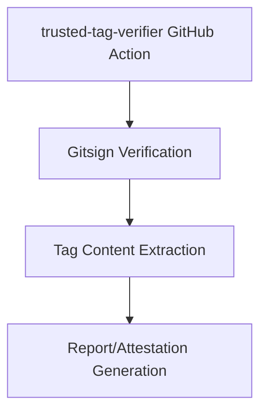

# 2025-04-11: Gitsign Tag Verification and Reporting

## Background

Git tags are commonly used to mark specific points in a repository's history, such as releases. However, without proper verification, tags can be spoofed or tampered with, leading to potential security vulnerabilities in the software supply chain.

[Gitsign](https://github.com/sigstore/gitsign) is a tool that integrates with Sigstore's Fulcio and Rekor to provide keyless signing for Git commits and tags. It uses OpenID Connect (OIDC) for authentication and generates ephemeral keys for signing, which are then logged in Rekor's transparency log. This provides a secure and auditable way to sign Git tags without the need for managing private keys.

The trusted-tag-releaser project currently generates releases with tags signed using Gitsign and produces in-toto attestations for release identity. However, there is a need for a companion tool that can verify these signed tags and extract their contents for reporting and auditing purposes.

## Problem Statement

When consuming software from a repository, it's important to verify that the tag being used is authentic and hasn't been tampered with. This verification process should include:

1. Checking that the tag is properly signed with Gitsign
2. Verifying the signature against Sigstore's Fulcio and Rekor
3. Extracting and displaying the tag contents
4. Generating a report or attestation about the verification results

Currently, this process requires manual steps and specialized knowledge of Sigstore's tools and APIs. There is a need for a GitHub Action that automates this process and makes it accessible to a wider audience.

## Goals

The primary goals of the trusted-tag-verifier GitHub Action are:

1. Provide a simple and reliable way to verify tags signed with Gitsign
2. Extract and display the contents of verified tags
3. Generate a comprehensive report or attestation about the verification results
4. Integrate seamlessly with the trusted-tag-releaser workflow
5. Be flexible enough to verify any Gitsign-signed tags with proper configuration

## Non-Goals

The following are explicitly out of scope for this project:

1. Signing tags (this is handled by Gitsign and the trusted-tag-releaser)
2. Verifying signatures that are not created with Gitsign
3. Modifying or creating new tags
4. Implementing a full Sigstore client

## Design Overview

The trusted-tag-verifier GitHub Action will be designed as a composite action that leverages existing tools from the Sigstore ecosystem, particularly Gitsign and cosign, to verify tags and extract their contents.

### High-Level Architecture



### Verification Process

The verification process will consist of the following steps:

1. **Input Validation**: Validate the input parameters, such as the tag name and repository URL.
2. **Tag Retrieval**: Fetch the specified tag from the repository.
3. **Signature Verification**: Use Gitsign's `verify-tag` command to verify the tag's signature against Fulcio and Rekor.
4. **Content Extraction**: Extract the contents of the tag, including the commit it points to, the tagger information, and the tag message.
5. **Certificate Analysis**: Extract and decode the Fulcio certificate extensions to get additional metadata about the signing environment.
6. **Report Generation**: Generate a comprehensive report about the verification results.
7. **Output**: Output the verification results as GitHub Action outputs and logs.

### Input Parameters

The GitHub Action will accept the following input parameters:

| Parameter | Description | Required | Default |
|-----------|-------------|----------|---------|
| `verify` | The repository and tag to verify in the format `<owner>/<repo>@<version>` | No | N/A |
| `repository` | The repository containing the tag to verify (ignored if `verify` is provided) | No | N/A |
| `tag` | The name of the tag to verify (ignored if `verify` is provided) | No | N/A |
| `fail-on-verification-error` | Whether to fail the action if verification fails | No | true |
| `trusted-tag-releaser-mode` | Whether to expect and verify trusted-tag-releaser specific metadata | No | true |
| `certificate-oidc-issuer` | The OIDC issuer to verify against | No | https://token.actions.githubusercontent.com |
| `certificate-identity-regexp` | The identity regexp to verify against | No | ^https://github.com/ |

Note: Either `verify` OR both `repository` and `tag` must be provided. The `verify` parameter takes precedence if both are specified.

Example usage with the `verify` parameter:

```yaml
- uses: actionutils/trusted-tag-verifier@v1
  with:
    verify: 'actionutils/trusted-tag-releaser@v1.2.3'
```

This format is particularly useful for automated updates with tools like Renovate, which can use regex patterns to identify and update version references.

### Output Parameters

The GitHub Action will produce the following output parameters:

| Parameter | Description |
|-----------|-------------|
| `verified` | Whether the tag was successfully verified (true/false) |
| `repository` | The repository that was verified (e.g., 'owner/repo') |
| `tag-name` | The name of the verified tag |
| `commit-sha` | The SHA of the commit that the tag points to |
| `verification-result` | The complete verification result as a JSON string |

### Verification Result Format

The verification result will be a JSON object that includes:

1. **Tag Information**: Basic information about the tag, such as its name, the commit it points to, and the tagger information.
2. **Signature Information**: Details about the signature, including the signing key, the timestamp, and the verification status.
3. **Certificate Information**: Information extracted from the Fulcio certificate, including the identity of the signer and any extensions.
4. **Rekor Entry**: Details about the Rekor transparency log entry, including the log index and the inclusion proof.
5. **Verification Results**: A summary of the verification results, including any errors or warnings.

Example JSON format:

```json
{
  "tag": {
    "name": "v1.0.0",
    "commit": "abcdef1234567890abcdef1234567890abcdef12",
    "tagger": {
      "name": "John Doe",
      "email": "john.doe@example.com",
      "timestamp": "2025-04-11T12:00:00Z"
    },
    "message": "Release v1.0.0"
  },
  "signature": {
    "verified": true,
    "keyid": "SHA256:abcdef1234567890abcdef1234567890abcdef1234567890abcdef1234567890",
    "timestamp": "2025-04-11T12:00:00Z"
  },
  "certificate": {
    "subject": "https://github.com/login/oauth",
    "issuer": "https://fulcio.sigstore.dev",
    "extensions": [
      {
        "name": "githubWorkflowTrigger",
        "value": "push"
      },
      {
        "name": "githubWorkflowRef",
        "value": "refs/tags/v1.0.0"
      },
      // ... other extensions
    ]
  },
  "rekor": {
    "logIndex": 12345678,
    "inclusionProof": "...",
    "integratedTime": "2025-04-11T12:00:00Z"
  },
  "verification": {
    "status": "success",
    "errors": [],
    "warnings": []
  }
}
```

This JSON result will be directly available as the `verification-result` output parameter, making it easy for users to access and filter specific fields using GitHub Actions expressions like `${{ fromJson(steps.verify.outputs.verification-result).tag.name }}`.

### Integration with trusted-tag-releaser (Optional)

When operating in `trusted-tag-releaser-mode`, the action will also look for and verify the release identity attestation generated by the trusted-tag-releaser. This includes:

1. Checking for the presence of a `release-identity.intoto.jsonl` file
2. Verifying that the file is properly formatted as an in-toto attestation
3. Validating that the attestation's subject matches the verified tag
4. Including the release identity information in the verification result

## Implementation Plan

The implementation of the trusted-tag-verifier GitHub Action will be divided into the following phases:

### Phase 1: Basic Verification

1. Set up the GitHub Action structure
2. Implement tag retrieval and basic signature verification using Gitsign's `verify-tag` command
3. Extract and display basic tag information
4. Generate a simple verification result

### Phase 2: Enhanced Verification and Reporting

1. Implement certificate extension decoding
2. Add Rekor transparency log verification
3. Enhance the verification result with detailed information
4. Generate the verification attestation

### Phase 3: trusted-tag-releaser Integration

1. Implement the `trusted-tag-releaser-mode`
2. Add verification of the release identity attestation
3. Integrate the release identity information into the verification result

### Phase 4: Documentation and Testing

1. Create comprehensive documentation
2. Develop test cases for various scenarios
3. Set up CI/CD for the action
4. Create example workflows

## Technical Details

### Implementation as a Composite Action

The trusted-tag-verifier will be implemented as a composite GitHub Action. It will use the Chainguard action `chainguard-dev/actions/setup-gitsign@1054a7f14edea88ef30dc2732c0a5e8d05db4ecc` to set up Gitsign in the workflow environment. Once Gitsign is set up, the action will use it to verify tags and extract certificate information, which will then be processed and output as verification results.

Example of how this will be implemented in the action.yml file:

```yaml
name: 'Trusted Tag Verifier'
description: 'Verify tags signed with Gitsign and display their contents'
inputs:
  # Input parameters as described above
runs:
  using: "composite"
  steps:
    - name: Setup Gitsign
      uses: chainguard-dev/actions/setup-gitsign@1054a7f14edea88ef30dc2732c0a5e8d05db4ecc
    
    - name: Verify Tag
      shell: bash
      run: |
        # Verify the tag using gitsign verify-tag
        # Extract and process certificate information
        # Generate verification result
```

### Repository Checkout Approach

Initially, the action will require checking out the repository to use the `gitsign verify-tag` command, as this is the most straightforward approach. However, we recognize that requiring a repository checkout has drawbacks, such as increased action execution time and potential security concerns.

As a future enhancement, we plan to implement verification without requiring a repository checkout. This will be done as an internal implementation detail, without exposing it as a user-configurable option. The two main approaches we're considering are:

1. **Direct API Access**: Using the GitHub API to fetch the tag object and its signature, then verifying the signature directly using Sigstore's libraries.

2. **Temporary Clone**: Creating a temporary, minimal clone of the repository that only includes the tag being verified.

The decision on which approach to use will be based on technical feasibility, performance, and security considerations. Once implemented, we'll migrate the action to use the non-checkout approach by default, without requiring users to change their workflows.

### Gitsign Verification

The action will use the `gitsign verify-tag` command to verify the tag's signature. This command checks that the signature is valid and was created with a key that chains to a trusted root certificate.

```bash
gitsign verify-tag --certificate-oidc-issuer='https://token.actions.githubusercontent.com' --certificate-identity-regexp='^https://github.com/' <tag-name>
```

### Certificate Extension Decoding

Extracting and decoding certificate extensions from Gitsign-signed tags is a critical part of the verification process. We need to carefully consider the approach to ensure it's robust, portable, and minimizes dependencies. Here are several options:

#### Option 1: Using Git and OpenSSL

One approach is to extract the signature from the tag and use OpenSSL to decode it:

```bash
git cat-file tag <tag-name> | sed -n '/-BEGIN/, /-END/p' | sed 's/^ //g' | sed 's/gpgsig //g' | sed 's/SIGNED MESSAGE/PKCS7/g' | openssl pkcs7 -print -print_certs -text
```

**Pros:**
- Uses widely available tools (Git and OpenSSL)
- Doesn't require additional dependencies
- Follows the approach documented in Gitsign

**Cons:**
- Relies on OpenSSL being available on the runner
- Parsing the text output of OpenSSL can be brittle
- May not work consistently across different versions of OpenSSL

#### Option 2: Using jc for JSON Conversion

Another approach is to use the `jc` tool to convert the certificate to JSON:

```bash
git cat-file tag <tag-name> | sed -n '/-BEGIN/, /-END/p' | sed 's/^ //g' | sed 's/gpgsig //g' | sed 's/SIGNED MESSAGE/PKCS7/g' > cert.pem
jc --x509-cert cert.pem
```

**Pros:**
- Produces structured JSON output
- Easier to parse and process
- More robust than text parsing

**Cons:**
- Adds a dependency on the `jc` tool
- May not be available on all runners
- Still requires OpenSSL for initial extraction

#### Option 3: Using Sigstore Libraries

A more integrated approach would be to use Sigstore's libraries directly to verify the signature and extract the certificate information. This would involve:

1. Extracting the signature from the Git tag
2. Using Sigstore libraries to parse and verify the signature
3. Extracting the certificate and its extensions

**Pros:**
- More integrated with Sigstore ecosystem
- Provides structured data directly
- Potentially more robust and maintainable

**Cons:**
- Requires additional dependencies
- May require adapting the libraries for Git tag signatures
- Implementation details would need to be worked out during development

#### Option 4: Custom Parser with Minimal Dependencies

We could implement a custom parser that extracts and decodes the certificate extensions with minimal external dependencies:

**Pros:**
- Minimizes external dependencies
- Can be tailored to our specific needs
- More control over the parsing process

**Cons:**
- Requires implementing complex ASN.1 parsing
- May be error-prone
- Higher development and maintenance cost

#### Recommendation

Given the trade-offs, we recommend a hybrid approach:

1. **Primary Method**: Investigate using Sigstore libraries to work with the certificates. This would provide the most integrated and maintainable solution.

2. **Fallback Method**: If Sigstore libraries aren't suitable, use the Git+OpenSSL approach with careful parsing of the output.

3. **Future Enhancement**: Consider implementing a more robust parser with minimal dependencies as the project matures.

This approach balances immediate functionality with long-term maintainability, while minimizing external dependencies.

### OID Mapping

Regardless of the extraction method, we'll need to map OIDs to human-readable names. The mapping will include:

```
1.3.6.1.4.1.57264.1.1 = githubWorkflowTrigger
1.3.6.1.4.1.57264.1.2 = githubWorkflowRef
1.3.6.1.4.1.57264.1.3 = githubWorkflowSha
1.3.6.1.4.1.57264.1.4 = githubWorkflowName
1.3.6.1.4.1.57264.1.5 = githubWorkflowRepository
...
```

This mapping will be maintained as part of the action's codebase and updated as new OIDs are defined by the Sigstore project.

### Tag Content Extraction

The action will use Git commands to extract the contents of the tag.

```bash
git cat-file tag <tag-name>
```

If we implement the non-checkout approach, we can use the GitHub API to fetch the tag contents:

```bash
curl -H "Accept: application/vnd.github.v3+json" \
  https://api.github.com/repos/<owner>/<repo>/git/refs/tags/<tag-name>
```

## Security Considerations

### Trust Model

The trusted-tag-verifier relies on the following trust anchors:

1. **Sigstore's Fulcio**: For verifying the certificate used to sign the tag
2. **Sigstore's Rekor**: For verifying the inclusion of the signature in the transparency log
3. **GitHub's OIDC**: For verifying the identity of the signer

The action will verify that the tag was signed with a certificate issued by Fulcio and that the signature is included in Rekor's transparency log. This provides a high level of assurance that the tag is authentic and hasn't been tampered with.

### GitHub Actions Specific Considerations

1. **Workflow Permissions**: The action should be run with minimal permissions, ideally only `contents: read` to access the repository.

2. **Secrets Handling**: The action should not require any secrets for basic operation, as it only needs to verify public information.

3. **Runner Security**: The action should be designed to work safely on both GitHub-hosted and self-hosted runners, with appropriate security measures for each environment.

4. **Input Validation**: All inputs should be properly validated to prevent injection attacks, especially when constructing commands or API requests.

### Recommendations

1. Always use the latest version of the trusted-tag-verifier action to ensure you have the latest security fixes.
2. Configure the action to fail on verification errors (`fail-on-verification-error: true`).
3. Use the verification result as part of your software supply chain security strategy.
4. Regularly audit the verification results.

## Future Extensions

While this design document focuses on the core functionality of verifying Gitsign-signed tags and generating reports, there are several potential extensions that could be explored in the future:

1. **Non-Checkout Verification**: Implement verification without requiring a repository checkout, as discussed in the Technical Details section.

2. **Policy Enforcement**: Add support for custom policies that define what constitutes a valid tag, such as requiring specific reviewers or approvals.

3. **Integration with SLSA**: Align the verification attestation with SLSA provenance to provide a more comprehensive view of the software supply chain.

4. **Historical Analysis**: Implement functionality to track and analyze verification results over time to detect patterns or anomalies.

## References

- [Sigstore](https://www.sigstore.dev/)
- [Gitsign](https://github.com/sigstore/gitsign)
- [Cosign](https://github.com/sigstore/cosign)
- [Rekor](https://github.com/sigstore/rekor)
- [Fulcio](https://github.com/sigstore/fulcio)
- [in-toto Attestation Framework](https://github.com/in-toto/attestation)
- [trusted-tag-releaser](https://github.com/actionutils/trusted-tag-releaser)